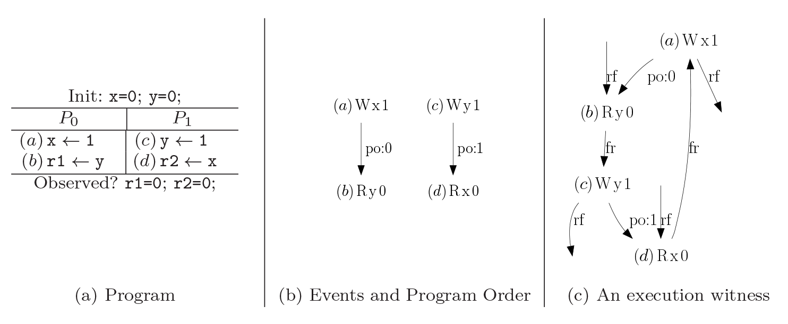
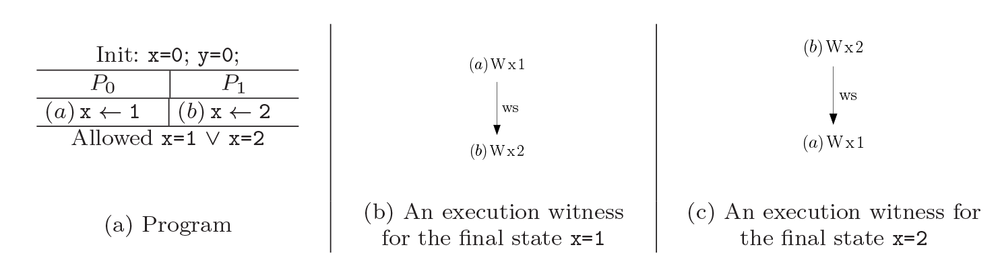

---
title: \textsf{CBMC}
author: Henrich Lauko
header-includes:
    - \usepackage{divine}
    - \usepackage{units}
    - \usepackage{tikz}
    - \usepackage{xspace}
    - \usepackage{listings}
    - \usetikzlibrary{shapes, arrows, shadows, positioning, calc, fit, backgrounds, decorations.pathmorphing}
    - \usepackage{xcolor}
    - \newcommand\todo[1]{\textcolor{red}{#1}}
lang: english
...
## CBMC 

1. CBMC concepts
2. Verification of concurrent programs
3. Closer look on memory models

## CBMC Concept

- Bounded Model Checker for C and C++ programs
    - constructs a propositional formula $\phi$ describing all possible executions of the system of bounded length
    - $(\phi \wedge \neg\text{\textit{specification}})$ is fed do SAT solver
- can deal with pointers, arrays and real size integers
- threads, and simulate various memory models

## CBMC Workflow
- create SSA form of program -- such program can be viewed as set of constraints
1. unroll loops
2. inline functions and bound number of recursion calls -- create goto program
3. transform to SSA form (generate set of constraints)

## Example
- bound is 2

\includegraphics[width=0.5\textwidth, right]{data/program1.png}

## Example -- Unroll Loops
- bound is 2

\begin{tabular}{c c}
\includegraphics[width=0.5\textwidth, right]{data/program1.png} & 
\begin{tabular}{l}\includegraphics[width=0.4\textwidth, right]{data/program_bounded.png} \end{tabular}\\
\end{tabular}

## Example -- Generating Constraints

\begin{tabular}{c c}
\includegraphics[width=0.4\textwidth, right]{data/program_bounded.png} & 
\includegraphics[width=0.6\textwidth, right]{data/program_constraints.png}\\
\end{tabular}

## Pointers and Arrays

- every assignment to a dereference of pointer is instantiated to several assignments (one for each possible value of pointer)

```c
*p_1 = 3;
```

- possible generated constraints:

```c
x_12 = (p_1 == &x) ? 3 : x_11;
y_7 = (p_1 == &y) ? 3 : y_6;
z_4 = (p_1 == &z) ? 3 : z_3;
...
```

- assignment to an array cell is treated similarly (instantiating for each possible value of the array index)
-  allocated memory is treated as a regular global variable
-  number of malloc calls is bounded

## CBMC for Concurrent Programs

- **Problems**:
    + access to global variables
        * race conditions
        * it is not possible to index assignments to global variables statically
    + modeling threads in bounded environment
        * allowing context switches only before visible statements
- **Translation process**:
    1. preprocessing - modeling nonatomic statements
    2. applying CBMC separately on each thread
    3. generating constraints for concurrency

## Stage 1 -- Preprocessing

- problems with access to more than one global variable
```c
    x_1 = g_1 + g_2;
```
- in assembly:
```
    r_a = g_1; r_b = g_2; r_c = r_a + r_b; x_1 = r_c;
```
- have to allow context switches between instructions
- CBMC generates similar code:
```
    y_1 = g_1; y_2 = g_2; x_1 = y_1 + y_2;
```
- accesses in conditions and loops are treated similarly

## Stage 2 -- Applying CBMC Separately on Each Thread
- create list of constraints for each thread - **template**
    + each variable has several copies
    + each copy appears only once on left-hand side of constraint
- created assignment statement types:
    1. expression over local variables to local variable
    
    $l_k = (guard_r ? lx_c * 2 : l_{k - 1})$
    2. expression over local variables to global variable
    
    $g_k = (guard_r ? lx_c * 2 : g_{k - 1})$
    3. global variable to local variable
    
    $l_k = (guard_r ? gx_k : l_{k - 1})$
    4. assignment to a guard variable
    
    $guard_r = guard_{r - 1} \wedge x_k > y_c$

## Stage 3 -- Generating Constraints for Concurrency

1. constraints on context switches
2. constraints on global variables
3. constraints on assignment statements

## Stage 3 -- Generating Constraints on Context Switches

- main idea -- to associate with each line in template a variable indicating number of context switches that occurs before this line $thread_t\_cs(l)$
- assignment to $thread_t\_cs(l)$ determines a concurrent execution over the thread templates
- added constraints on $thread_t\_cs(l)$:
    - **Monotonicity** $\forall_{0 \leq l < m - 1} thread_t\_cs(l) \leq thread_t\_cs(l + 1)$
    - **Interleaving bound** $thread_t\_cs(m - 1) \leq n$
    - **Parity** $\forall_{0 \leq l < m - 1} (thread_t\_cs(l) \mod 2) = t$
- $m - 1$ -- number of constraints in template
- $n$ -- interleaving bound

## Stage 3 -- Context Switching


## Stage 3 -- Constraints on Global Variables

- generate $n$ new variables $x\_val_i$ for each global variable $x$
    - $x\_val_i$ is value of variable $x$ at the end of $i$-th context switch block
- $x\_val_i$ should get its value according to the last assignment that was
made to $x$ in the $i$-th context switch block
    - if $x$ was assigned in the $i$-th context switch block, $x\_val_i$ will be equal to the last assignment to $x$ in this block
    - else $x\_val_i = x\_val_{i - 1}$ preserves the value it had at the end of the previous block

## Stage 3 -- Translation of Statements to Constraints

1. expression over local variables to local variable
    - add the thread prefix

2. assignment of global variable $x_i$ to local variable $l_k$
    - if assignment to $x_i$ in the same context, simply add thread prefix
    - otherwise is used $x\_val$ of previous block

3. expression over local variables to global variable
    - similarly as previous

4. assignment to a guard variable
    - guards are local, so add only prefixes

## Concurrency - Pointers and Arrays

- no special treatment to support assignments to a pointer dereference or to cell in an array
- only problem is dereference of pointer to global variable

```c
v_1 = *p + v_2;
```
- break statement to more small statements:
    
```c 
y = *p; v_1 = y + v_2;
```

## More Than Two Threads

- change to parity constraint

1. round-robin 
    - thread may do nothing, but increases number of context switches 
2. add new variables $run_i$ representing thread that runs in context switch block

## Modeling Synchronization Primitives

**atomic sections** - add constraints to force $thread_t\_cs$ values to be identical in atomic section

**mutexes**
- model only _wait-free_ executions -- if a thread tries to lock a mutex,
it either succeeds or this execution is eliminated
- own mutex implementation of lock and unlock:

- lock:
```c
atomic {
    assume(*mutex == U);
    *mutex = L;
}
```

- unlock:
```c
atomic {
    assert(*mutex == L);
    *mutex = U;
}
```

## Detecting races

- created new variable $x\_write\_flag$ that is raised whenever $x$ is defined and lowered in the next instruction
```c
atomic {
    assert(x_write_flag == 0);
    x = 3;
    x_write_flag = 1;
}
x_write_flag = 0;
```
- on every access to $x$ is added assert that its $x\_write\_flag$ is low
```c
atomic{
    assert(x_write_flag == 0);
    y = x;
}
```
- on assignment to dereference of pointer $p$ flag is raised to all possible variables which $p$ might point to

## Weak Memory Models Introduction

\vspace{-20pt}



- $po$ -- program order
- $rf$ -- read from:

    $(w,r) \in rf \iff r$ reads value written by $w$
- $ws$ -- write serialization -- total order on writes to the same location
- $fr$ -- from read:
    $(r,w) \in fr \iff \exists w'.(w',r) \in rf \wedge (w',w) \in ws$

## Weak Memory Models Witness



## CBMC Weak Memory Models 

- modern architectures modeled by relaxer relations
    + $rfi$ -- internal read from, corresponds to read from the store buffer (TSO)
    + $ppo$ -- program order pairs (e.g., write-read pairs on x86)
    + $rfe$ -- external read from, when two processors can communicate privately via a cache (Power, ARM)
    + $ab_A$ -- relation induced by fences of architecture A
    + $dp$ --  dependencies between instructions
- execution is valid on $A$ when following holds:
    1. SC holds per address = $acyclic(ws \cup rf \cup fr \cup \text{po-loc})$
    2. Values do not come out of thin air = $acyclic(rf \cup dp)$
    3. ...
- symbolic event structure

## 

\centering
Thank you.
